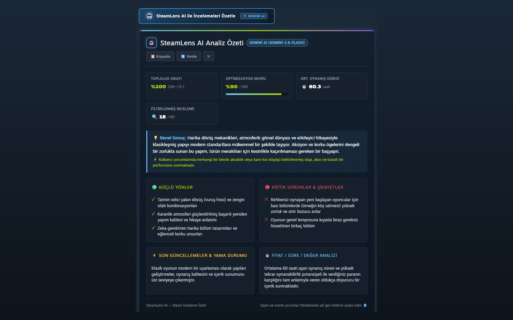
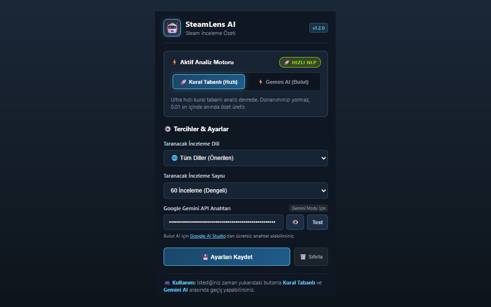
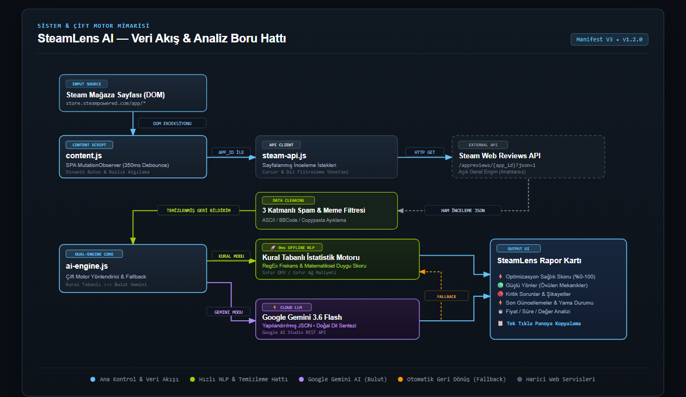

# 🤖 SteamLens AI — Steam İnceleme Özeti

<div align="center">


**Steam mağazasındaki kullanıcı incelemelerini akıllı algoritmalar ve Google Gemini AI ile filtreleyip saniyeler içinde net bir oyun karnesine dönüştüren yeni nesil Chrome eklentisi.**

[📸 Ekran Görüntüleri](#-ekran-görüntüleri) • [🎯 Projenin Amacı](#-projenin-amacı) • [🚀 Öne Çıkan Özellikler](#-öne-çıkan-özellikler) • [🧩 Çözülen Problemler](#-çözülen-problemler) • [🎮 Kullanım Senaryoları](#-gerçek-kullanım-senaryoları) • [🛠️ Teknoloji & Mimari](#-teknoloji-ve-mimari) • [📂 Proje Yapısı](#-proje-dosya-yapısı) • [📦 Kurulum Rehberi](#-kurulum-rehberi) • [🔒 Gizlilik & Güvenlik](#-gizlilik-ve-güvenlik)

</div>

---

## 📸 Ekran Görüntüleri

<div align="center">
  
  <p><em>Google Gemini Flash AI ile derinlemesine inceleme analizi ve oyun karnesi.</em></p>
  
  <br>

  
  <p><em>Kullanıcı dostu kontrol paneli ve canlı analiz motoru geçiş anahtarı.</em></p>
</div>

---

## 🎯 Projenin Amacı

Steam'de bir oyun satın almayı düşündüğünüzde karşınıza binlerce kullanıcı incelemesi çıkar. Ancak bu incelemelerin önemli bir kısmı:
- Tek kelimelik meme ve şakalar (*"10/10"*, *"Amogus"*, *"Hanımım beni terk etti"*),
- ASCII kedi ve tablo çizimleri,
- Steam puanı toplamak için atılmış kopyala-yapıştır metinlerden ibarettir.

**SteamLens AI'ın temel amacı:** Yüzlerce yorumun arasındaki gürültüyü (noise) gelişmiş filtrelerle temizlemek ve geriye kalan saf kullanıcı deneyimini (signal) oyuncuya **"Bu oyun alınır mı, performansı nasıl, güçlü ve zayıf yönleri neler?"** sorularının cevabı olarak sunmaktır.

---

## 🚀 Öne Çıkan Özellikler

### 1. ⚡ Çift Motor Teknolojisi (Dual-Engine)
Kullanıcılar tek bir tıklamayla iki farklı analiz motoru arasında anında geçiş yapabilir:
- **🚀 Kural Tabanlı NLP & İstatistik (Varsayılan):** Sıfır gecikme (5 ms), sıfır GPU/ağ yükü ve tamamen çevrimdışı matematiksel duygu analizi. Donanımınızı asla yormaz, fan açtırmaz.
- **⚡ Google Gemini AI (Bulut):** Google AI Studio API anahtarı ile çalışan, incelemelerdeki ironileri, karmaşık şikayetleri ve oynanış nüanslarını bir oyun eleştirmeni gibi sentezleyen derin dil modeli.

### 2. 🛡️ Akıllı Spam & Meme Filtreleme
Steam'den çekilen incelemeleri 3 katmanlı filtreleme algoritmasından geçirir:
- ASCII art, Braille sanatı ve kutucuk kopyalamalarını ayıklar.
- BBCode/HTML etiketlerini ve gürültülü kısa metinleri temizler.
- Kullanıcıya kaç incelemenin çekildiğini ve kaçının filtrelenerek analize girdiğini şeffafça gösterir (Örn: `🔍 32 / 80`).

### 3. 📊 Kapsamlı Oyun Karnesi
- **💡 Genel Değerlendirme & Satın Alma Tavsiyesi:** Oyunun genel kalitesi hakkında net özet.
- **⚡ Optimizasyon Sağlık Skoru (%0 - %100):** FPS düşüşleri, takılmalar (stutter), çökmeler ve donanım uyumluluğu skoru.
- **🟢 Güçlü Yönler (Artılar):** Topluluğun en çok övdüğü mekanikler ve özellikler.
- **🔴 Kritik Sorunlar & Şikayetler (Eksiler):** Oyuncuların en çok yakındığı hatalar veya eksiklikler.
- **⚡ Son Güncellemeler & Yama Durumu:** Son güncellemelerin oyunu toparlayıp toparlamadığı.
- **⏱️ Fiyat / Süre / Değer Analizi:** Ortalama oynanış süresine göre indirim tavsiyesi.
- **📋 Tek Tıkla Panoya Kopyalama:** Üretilen raporu arkadaşlarla veya forumlarda paylaşmak için şık biçimlendirilmiş metin çıktısı.

---

## 🧩 Çözülen Problemler

| Geleneksel Yöntem | SteamLens AI Çözümü |
| :--- | :--- |
| **Yüzlerce yorumu tek tek okumak zorunda kalmak** | Tek tıkla 5 saniye içinde tüm topluluğun ortak fikrini özetleyen karne üretir. |
| **Meme, şaka ve copypasta yorumların arasında boğulmak** | Spam filtreleme motoru gürültüyü çöpe atar, sadece yapıcı eleştirileri analiz eder. |
| **Oyunun mevcut teknik durumunu bilememek** | Kelime frekans analiziyle son yamaların optimizasyon üzerindeki etkisini raporlar. |
| **Ağır yerel modellerin ekran kartını ve fanları çalıştırması** | Yüksek hızlı kural tabanlı NLP ve hafif Google Bulut API kullanılarak GPU kullanımı sıfırlanmıştır. |
| **Sayfa yenileme gereksinimi** | Canlı depolama dinleyicisi (`chrome.storage.onChanged`) ile ayarlardaki mod değişimi açık sekmelere anında yansır. |

---

## 🎮 Gerçek Kullanım Senaryoları

### Senaryo 1: Büyük Steam İndirim Dönemleri
Steam yaz/kış indirimlerinde istek listenizdeki 20 oyunu hızlıca elemek istiyorsunuz. Her oyunun sayfasına girip **"SteamLens AI ile İncelemeleri Özetle"** butonuna basarak 1 dakika içinde hangi oyunların teknik olarak hazır, hangilerinin hayal kırıklığı olduğunu görürsünüz.

### Senaryo 2: "Son Yama Oyunu Düzeltti mi?" Kontrolü
Çıkışında optimizasyon sorunları olan bir oyun (örneğin Cyberpunk 2077 veya Star Wars Jedi: Survivor) güncelleme aldı. Eklenti, **"Son Güncellemeler & Yama Durumu"** bölümünde topluluğun son yamalardan memnun olup olmadığını anında bildirir.

### Senaryo 3: Fiyat / İçerik Dengesi Analizi
Bir oyunun 30$ veya 60$'a değip değmeyeceğini merak ediyorsunuz. Eklenti, oyuncuların ortalama oynanış saatini (`⏱️ Ort. Oynanış`) ve içerik doyuruculuğunu hesaplayarak *"İndirim beklenmeli"* veya *"Tam fiyatını hak ediyor"* önerisinde bulunur.

---

## 🛠️ Teknoloji ve Mimari

<div align="center">
  
</div>

<br>

- **Manifest V3:** Modern Chrome eklenti standartlarına %100 uyumlu mimari.
- **Modern Vanilla JavaScript (ES6+):** Harici kütüphane bağımlılığı olmadan maksimum hız ve sıfır bundle boyutu.
- **Steam Web Reviews API:** Steam mağaza incelemelerini doğrudan `https://store.steampowered.com/appreviews/<appid>` üzerinden çeker.
- **Google Generative Language API:** BYOK (Bring Your Own Key) modeliyle kullanıcının kendi anahtarı üzerinden `gemini-3.6-flash` ile doğrudan haberleşir.
- **Chrome Storage Local API:** Ayarlar, dil tercihleri ve API anahtarları tamamen kullanıcının yerel tarayıcısında saklanır.
- **Debounced MutationObserver:** Steam'in dinamik sayfa geçişlerini (SPA) tarayıcıyı yormadan (350 ms geciktirmeli) akıllıca takip eder.

---

## 📂 Proje Dosya Yapısı

```text
steamlens-ai/
├── manifest.json              # Manifest V3 konfigürasyonu (Storage & Steam/Gemini Host İzinleri)
├── icons/                     # 16x16, 48x48, 128x128 boyutunda telifsiz saf PNG ikonlar
├── generate_icons.py          # Standart Python ile matematiksel PNG ikon oluşturucu
├── screenshots/               # Mağaza ve GitHub için 1280x800 HD ekran görüntüleri
├── assets/                    # Mimari şeması (architecture.html & architecture.png)
├── test_logic.js              # Duygu analizi ve spam temizleme birim testleri (Unit Tests)
├── src/
│   ├── background/
│   │   └── service-worker.js  # Yaşam döngüsü, storage yönetimi ve mesaj köprüsü
│   ├── content/
│   │   ├── steam-api.js       # Steam Public API istemcisi, 3 katmanlı BBCode ve spam/meme filtresi
│   │   ├── ai-engine.js       # Çift Motorlu Analiz Motoru (Google Gemini 3.6 Flash + Kural Tabanlı Hızlı NLP)
│   │   ├── content.js         # Steam DOM enjeksiyonu, SPA 350ms debounced observer, dinamik rozet & panoya kopyalama
│   │   └── content.css        # Steam natif dark temalı modern arayüz, skeleton ve animasyonlar
│   └── popup/
│       ├── popup.html         # Canlı motor geçiş anahtarı (Kural Tabanlı / Gemini AI), dil tercihleri ve BYOK paneli
│       ├── popup.css          # Steam karanlık/neon temalı açılır kontrol paneli
│       └── popup.js           # Dinamik Gemini model keşfi, API test mekanizması ve anlık ayar senkronizasyonu
├── README.md                  # Kapsamlı geliştirici & kullanıcı dokümantasyonu, ekran görüntüleri ve mimari şema
├── LICENSE                    # Resmi MIT Lisansı (Copyright 2026 Harun)
└── CHROMEWEBSTORE.md          # Chrome Web Store yayınlama kılavuzu, izin gerekçeleri ve mağaza metinleri
```

---

## 📦 Kurulum Rehberi

### Geliştirici Modunda Yükleme (Manuel Kurulum):

1. Bu projeyi bilgisayarınıza klonlayın veya indirin:
   ```bash
   git clone https://github.com/HarunUYGUC/steamlens-ai.git
   ```
2. Google Chrome'u açın ve adres çubuğuna `chrome://extensions` yazın.
3. Sağ üst köşedeki **"Geliştirici modu" (Developer mode)** anahtarını aktif hale getirin.
4. Sol üstteki **"Paketlenmemiş öge yükle" (Load unpacked)** butonuna tıklayın.
5. Projenin bulunduğu `steamlens-ai` klasörünü seçin.
6. Eklenti anında kurulacak ve simgesi Chrome araç çubuğuna eklenecektir!

### İsteğe Bağlı: Google Gemini AI Modunu Açma:
1. [Google AI Studio](https://aistudio.google.com/app/apikey) sayfasına gidin ve ücretsiz bir API anahtarı alın.
2. Eklenti simgesine (Popup) tıklayın.
3. Anahtarı yapıştırıp **"Test"** ve ardından **"💾 Ayarları Kaydet"** butonuna basın.
4. Artık dilediğiniz zaman üstteki butonla **Kural Tabanlı** veya **Gemini AI** arasında geçiş yapabilirsiniz.

---

## 🔒 Gizlilik ve Güvenlik

- **Sıfır İzleme / Sıfır Telemetri:** Eklenti hiçbir kullanıcı verisini, ziyaret edilen sayfaları veya arama geçmişini toplamaz veya harici sunuculara göndermez.
- **Yerel BYOK Modeli:** Google Gemini API anahtarınız kaynak kodlarda yer almaz; yalnızca kendi bilgisayarınızdaki izole `chrome.storage.local` alanında tutulur.
- **Kaynak Kod Güvenliği:** Projede `.gitignore` yapılandırması mevcut olup, hassas konfigürasyon dosyaları asla repoya dahil edilmez.

---

## 📄 Lisans

Bu proje [MIT Lisansı](LICENSE) altında açık kaynak olarak sunulmaktadır.
Dilediğiniz gibi geliştirebilir, özelleştirebilir ve kullanabilirsiniz.
