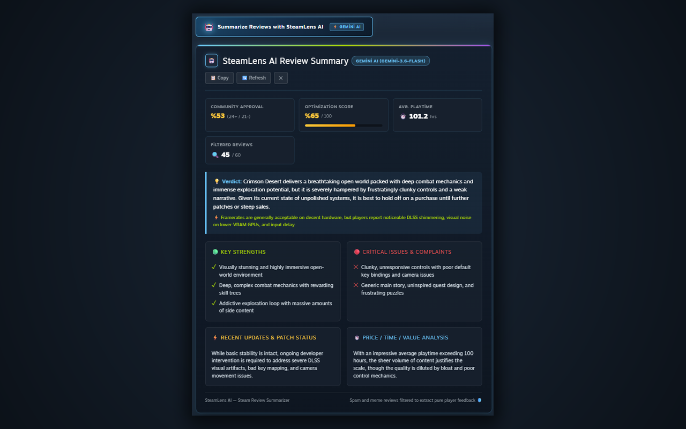
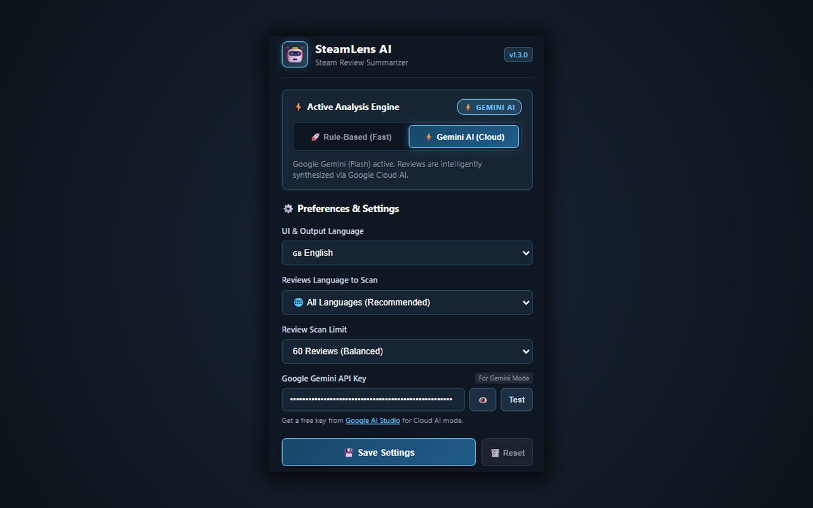

# 🤖 SteamLens AI — Steam Review Summarizer

<div align="center">

[](https://chromewebstore.google.com/detail/lmkldcljijogblmkggcclnjffadheaoo?utm_source=item-share-cb)
[](manifest.json)
[](manifest.json)
[](src/shared/i18n.js)
[](src/content/ai-engine.js)
[](PRIVACY_POLICY.md)
[](LICENSE)

**An intelligent Chrome Extension that filters out meme/spam reviews on Steam and generates an instant, actionable game scorecard using Dual-Engine AI (Google Gemini + High-Speed Local NLP) in English and Turkish.**

[🚀 **Install from Chrome Web Store**](https://chromewebstore.google.com/detail/lmkldcljijogblmkggcclnjffadheaoo?utm_source=item-share-cb)

<br>

[Screenshots](#-screenshots) • [The Problem & Motivation](#-the-problem--motivation) • [Key Features](#-key-features) • [Full Internationalization (i18n)](#-full-internationalization-i18n) • [Problems Solved](#-problems-solved) • [Real-World Use Cases](#-real-world-use-cases) • [Architecture & Tech Stack](#-architecture--tech-stack) • [Project Structure](#-project-structure) • [Installation Guide](#-installation-guide) • [Privacy & Security](#-privacy--security) • [License](#-license)

</div>

---

## 📸 Screenshots

<div align="center">
  
  <p><em>In-depth game review synthesis, optimization score, pros & cons generated on-demand.</em></p>
  
  <br>

  
  <p><em>Intuitive popup panel: real-time engine toggle, language preferences, and BYOK Gemini configuration.</em></p>
</div>

---

## 🎯 The Problem & Motivation

Whenever you browse Steam to decide on a purchase, you're faced with thousands of user reviews. However, a significant portion of them consist of:
- One-word jokes and copypastas (*"10/10"*, *"My dog played it"*, *"My wife left me"*),
- ASCII art cats, thumbs, and text walls,
- Low-effort reviews posted solely to farm Steam Community points and awards.

**The Mission of SteamLens AI:** Automatically strip away the noise and extract the genuine community signal. In seconds, it answers the vital questions gamers care about: **"Is this game worth buying? How is the performance and stuttering? What are the biggest pros and critical complaints?"**

---

## 🚀 Key Features

### 1. ⚡ Dual-Engine Architecture
Seamlessly switch between two distinct analysis engines with a single click:
- **🚀 Fast Rule-Based NLP & Statistics (Default):** Runs 100% locally in your browser in **0.01 seconds**. Zero latency, zero GPU overhead, and no API key required. Never spins up your laptop fans or stresses your hardware.
- **⚡ Cloud Google Gemini AI (Optional):** Powered by your personal Google AI Studio API key (BYOK). Synthesizes review sentiment, catches sarcasm, and provides nuanced game critic analysis using Google's fastest `Flash` models (`gemini-3.6-flash`, `gemini-2.5-flash`, `gemini-2.0-flash`).

### 2. 🛡️ Multi-Tier Spam & Meme Filter
Every batch of reviews fetched from Steam passes through a 3-stage cleaning pipeline:
- Filters out ASCII art, Braille patterns, and character-box copypastas.
- Strips BBCode, HTML formatting, and uninformative meme phrases.
- Transparently displays how many reviews were scanned and how many constructive reviews entered analysis (e.g., `🔍 45 / 60`).

### 3. 📊 Comprehensive Game Scorecard
- **💡 Verdict & Purchasing Recommendation:** Concise 2-sentence bottom-line assessment.
- **⚡ Optimization / FPS Health Score (0–100%):** Assesses frame drops, stuttering, crashing reports, and hardware stability.
- **🟢 Key Strengths (Pros):** Gameplay mechanics, visuals, and audio most praised by the community.
- **🔴 Critical Issues & Complaints (Cons):** Bug reports, balancing flaws, or performance issues flagged by players.
- **⚡ Recent Updates & Patch Status:** Real-time feedback on whether recent developer patches solved launch-day problems.
- **⏱️ Price / Time / Value Analysis:** Evaluates price-to-content value based on average player playtime hours.
- **📋 One-Click Copy to Clipboard:** Formats the entire scorecard as clean markdown/text to share with friends on Discord or forums.

---

## 🌐 Full Internationalization (i18n)

SteamLens AI is built from the ground up for the global Steam community:
* **Auto Language Detection:** Automatically adapts to your browser language (`en` or `tr`).
* **Live In-Place Switching:** Toggle between **🌐 Auto**, **🇬🇧 English**, or **🇹🇷 Turkish** inside the popup without reloading your tabs.
* **Bilingual Analysis Engine:** Both the Local NLP engine and Gemini AI generate comprehensive scorecards in your selected language.
* **Full Web Store Localization:** Ships with native `_locales/` strings for Chrome Web Store indexing worldwide.

---

## 🧩 Problems Solved

| Traditional Steam Browsing | With SteamLens AI |
| :--- | :--- |
| Reading through dozens of unhelpful reviews | Generates an objective, structured scorecard in seconds with a single click. |
| Drowning in ASCII memes and point-farming copypastas | 3-stage spam filter strips out jokes and focuses solely on constructive critique. |
| Unsure if recent patches resolved launch performance | Word-frequency and sentiment analyzer tracks recent update sentiment. |
| Heavy local LLMs stressing your GPU and fans | 0.01s client-side rule NLP or lightweight Google Cloud API with 0% local GPU load. |
| Inflexible settings requiring constant page refreshes | Reactive `chrome.storage.onChanged` listener synchronizes settings across tabs in real-time. |

---

## 🎮 Real-World Use Cases

### Scenario 1: Steam Seasonal Sales (Summer / Winter Sale)
You have 25 games on your wishlist during a major sale. Instead of spending 15 minutes per game scrolling through reviews, click **"Summarize Reviews with SteamLens AI"** on each page to evaluate performance and gameplay loops in under 1 minute.

### Scenario 2: "Did the Latest Patch Fix the Game?"
A game launched with stuttering or optimization bugs (e.g., *Cyberpunk 2077* or *Star Wars Jedi: Survivor*). The **Recent Updates & Patch Status** card instantly reveals whether community consensus agrees that the latest hotfix resolved the issues.

### Scenario 3: Price-to-Playtime Value Check
Wondering if a \$30 or \$70 title is worth full price? SteamLens AI calculates average player playtime (`⏱️ Avg. Playtime`) and provides tailored advice: *"Wait for a sale"* vs. *"Justifies full price"*.

---

## 🛠️ Architecture & Tech Stack

<div align="center">
  
</div>

<br>

- **Manifest V3:** Fully compliant with modern Chrome Extension standards and declarative lifecycles.
- **Standard Chrome i18n (`_locales`):** Production-grade internationalization for Web Store metadata.
- **Pure Vanilla JavaScript (ES6+):** Zero external framework dependencies for maximum execution speed and a tiny bundle size (<40 KB).
- **Steam Web Reviews API:** Pulls public reviews directly from Valve's official endpoint: `https://store.steampowered.com/appreviews/<appid>`.
- **Google Generative Language API:** Direct HTTPS communication using your personal key (BYOK) with automated fallback (`gemini-3.6-flash`, `gemini-2.5-flash`, `gemini-2.0-flash`).
- **Chrome Storage Local API:** User preferences, selected engine modes, and optional API keys are stored strictly on your local device.
- **Debounced MutationObserver:** Accurately detects Steam Store SPA (Single Page Application) navigation changes with a 350ms debounce to prevent layout thrashing.

---

## 📂 Project Structure

```text
steamlens-ai/
├── manifest.json              # Chrome Manifest V3 configuration (i18n, storage, permissions)
├── _locales/                  # Standard Chrome localization directory
│   ├── en/messages.json       # English store and extension metadata
│   └── tr/messages.json       # Turkish store and extension metadata
├── icons/                     # 16x16, 48x48, 128x128 high-res PNG extension icons
├── screenshots/               # High-resolution 1280x800 store & README screenshots
├── assets/                    # System architecture guides and visual diagrams
├── test_logic.js              # Automated unit tests (NLP sentiment, meme filter, i18n)
├── src/
│   ├── shared/
│   │   └── i18n.js            # Central dictionary and dynamic language resolver
│   ├── background/
│   │   └── service-worker.js  # Extension lifecycle, storage defaults, and message bridge
│   ├── content/
│   │   ├── steam-api.js       # Steam API client, 3-stage BBCode and spam filtering
│   │   ├── ai-engine.js       # Dual-Engine core (Gemini Flash + Fast Rule NLP)
│   │   ├── content.js         # Steam DOM injection, SPA observer, scorecard rendering
│   │   └── content.css        # Steam-native dark theme styles, skeletons, and badges
│   └── popup/
│       ├── popup.html         # Settings control panel, engine toggle, and BYOK form
│       ├── popup.css          # Steam-themed popup interface styling
│       └── popup.js           # Live preferences sync, fast API key testing, and mode control
├── PRIVACY_POLICY.md          # Formal Chrome Web Store compliant privacy policy
├── LICENSE                    # MIT License (Copyright 2026 Harun)
└── README.md                  # Comprehensive project documentation
```

---

## 📦 Installation Guide

### Option 1: Install from Chrome Web Store (Recommended)
Install the extension with a single click from the official store:  
👉 **[SteamLens AI on the Chrome Web Store](https://chromewebstore.google.com/detail/lmkldcljijogblmkggcclnjffadheaoo?utm_source=item-share-cb)**

### Option 2: Manual Installation (Developer Mode)

1. Clone or download this repository:
   ```bash
   git clone https://github.com/HarunUYGUC/steamlens-ai.git
   ```
2. Open Google Chrome and navigate to `chrome://extensions/`.
3. Enable **Developer mode** using the toggle in the top-right corner.
4. Click **Load unpacked** in the top-left corner.
5. Select the `steamlens-ai` directory.
6. The extension is now installed and active! Visit any Steam game store page to test it.

---

### Optional: Enabling Google Gemini AI Mode (BYOK)

1. Obtain a free API key from [Google AI Studio](https://aistudio.google.com/app/apikey).
2. Click the SteamLens AI icon in your browser toolbar to open the settings popup.
3. Paste your API key into the input field and click **Test**.
4. The system validates the key in under 1 second and saves your settings.
5. You can now freely toggle between **Rule-Based (Fast NLP)** and **Gemini AI (Cloud)** anytime!

---

## 🔒 Privacy & Security

SteamLens AI adheres strictly to a privacy-first, client-side model:
- **Zero Telemetry / No Tracking:** We do not collect, track, or sell your browsing history, Steam account details, or personal information.
- **Client-Side Storage:** Your settings and optional Gemini API key are stored strictly in your browser's private `chrome.storage.local`.
- **Encrypted Transmission:** When Gemini mode is active, reviews are transmitted directly from your browser to Google AI Studio via encrypted HTTPS.
- Read our full [Privacy Policy](PRIVACY_POLICY.md) for complete details.

---

## 📄 License

This project is open-source and licensed under the [MIT License](LICENSE).

Steam and the Steam logo are registered trademarks of Valve Corporation. This project is not affiliated with Valve Corporation.
